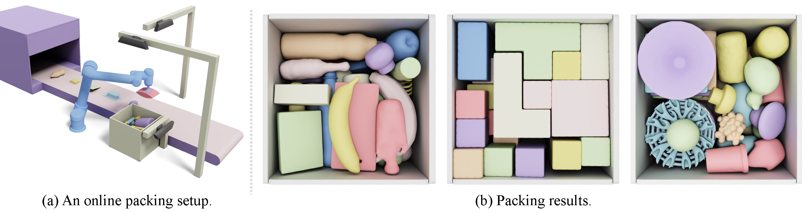

# IR-BPP: Learning Physically Realizable Skills for Online Packing of General 3D Shapes


We develop a learning-based solver for packing arbitrarily-shaped objects in a physically realizable problem setting, which is arguably the most challenging setting of bin packing problems. This work is newly been accepted by **ACM Transactions on Graphics (TOG)**. 
See these links for video demonstration: [YouTube](https://www.youtube.com/watch?v=z4Q05EGcW64&t=56s), [bilibili](https://www.bilibili.com/video/BV1ho4y1M7gG/)


We release our source code and build well-established benchmark datasets. Our datasets consist of training and testing objects, separated into discrete cuboidal sets, continuous cuboidal sets, and large-scale irregular sets with various geometric characteristics, and specifying a container size. 

As our TOG reviewers suggested, although there have been numerous packing papers using RL for higher packing density, there is a lack of a **common** dataset to benchmark performance. We believe that having such a common benchmark would greatly facilitate research and comparison of different techniques.


**This repo is being continuously updated, please stay tuned!**


If you are interested, please star this repo! 



## Paper
For more details, please see our paper [Learning Physically Realizable Skills for Online Packing of General 3D Shapes](https://openreview.net/forum?id=bfuGjlCwAq). If this code is useful for your work, please cite our paper:

```
@article{zhao2022learning,
  title={Learning Physically Realizable Skills for Online Packing of General 3D Shapes},
  author={Zhao, Hang and Pan, Zherong and Yu, Yang and Xu, Kai},
  journal={arXiv preprint arXiv:2212.02094},
  year={2022}
}
``` 

### Performance 
We provide the packing utility performance of our method on each dataset here for quick comparison. We run all methods in the same environment setup with the same test sequences. A total of 2000 object sequences, randomly generated from each dataset, are tested.

| Dataset            | Online | Buffered (k = 3) | Buffered (k = 5) | Buffered (k = 10) |
|--------------------|:------:|-----------------:|-----------------:|------------------:|
| *General*          | 44.5%  |            45.3% |            47.5% |             55.7% |
| *BlockOut*         | 71.0%  |            71.7% |            74.8% |             78.0% |
| *Kitchen*          | 39.2%  |            44.3% |            48.8% |             57.8$ |
| *ABC*              | 34.0$  |            35.3% |            37.4% |             41.0% |
| *Box (discrete)*   |        |                  |                  |                   |
| *Box (continuous)* |        |                  |                  |                   |

## Dependencies
* Please install dependencies by running this: pip install -r requirements.txt
* This code is verified on OS: Ubuntu 16.04.

## Quick start

For training online IR-BPP on the *blockout* dataset (mentioned in our paper) with our method and the default arguments:
```bash
python main.py 
```
The training data is generated on the fly. The training logs (tensorboard) are saved in './logs/runs'. Related file backups are saved in './logs/experiment'.

## Usage

### Data description

[//]: # (Describe your 3D container size and 3D item size in 'givenData.py')

[//]: # (```)

[//]: # (container_size: A vector of length 3 describing the size of the container in the x, y, z dimension.)

[//]: # (item_size_set:  A list records the size of each item. The size of each item is also described by a vector of length 3.)

[//]: # (```)
If you need to adjust the container size or the height map resolution, so that the size of discretized height map changed, you should adjust the CNN in 'model.py' so that it can take the modified height map as input.

### Dataset
You can download the prepared dataset from [here](https://drive.google.com/drive/folders/1TibQqFfzugui1gBI_wIcW6H6CzF_cIwj?usp=sharing). Unzip the downloaded datasets and place them into 'IR-BPP/dataset'. Each dataset includes:

shape_vhacd (folder): Watertight convex decompositions of each polygonal mesh shape. Used for accurate physics simulation.

pointCloud (folder): Point clouds pre-sampled from mesh surface. The DRL agent will re-sample 1024 points and pass them to a lightweight pointNet for shape representation.


test_sequence.pt: 
The dataset consists of 10000 randomly generated trajectories, each with 100 shapes. Each item with a specified planar-stable pose is presented as an id, recorded in 'id2shape.pt'.

id2shape.pt: Map the shape id to the shape name.

Contact me (alex.hang.zhao@gmail.com) if you need the corresponding undecomposed mesh files, for rendering and paper writing needs.


### Model
We provide pre-trained models [here](https://drive.google.com/drive/folders/1s9W7lGUTvhpiQN2CDzxkxUiPAOEfj9Yr?usp=sharing).

[//]: # (trained using the EMS scheme in a discrete environment, where the bin size is &#40;10,10,10&#41; and the item size range from 1 to 5.)

### Training

For training online 3D BPP instances on  BlockOut:
```bash
python main.py --device 0 --data_name blockout --custom blockoutexp --previewNum 1  --num_processes 16 --distributed --samplePointsNum 1024 --selectedAction 500 --resolutionA 0.02 --resolutionH 0.01
```
If you want to train a model that works on the **buffered** case with buffer size 10, add '--hierachical' and '--previewNum 10'':
```bash
python main.py --device 0 --data_name blockout  --custom blockoutexp --hierachical  --previewNum 10 --num_processes 16 --distributed --samplePointsNum 1024 --selectedAction 500 --resolutionA 0.02 --resolutionH 0.01
```


### Evaluation
To evaluate a model, you can add the `--evaluate` flag to `main.py`, for example:
```bash
python main.py --evaluate --device 0 --data_name blockout --custom blockoutexp --previewNum 1  --num_processes 16 --distributed --samplePointsNum 1024 --selectedAction 500 --resolutionA 0.02 --resolutionH 0.01
```

### Help
```bash
python main.py -h
```

### License
```
This source code is released only for academic use. Please do not use it for commercial purposes without authorization of the author.
```
